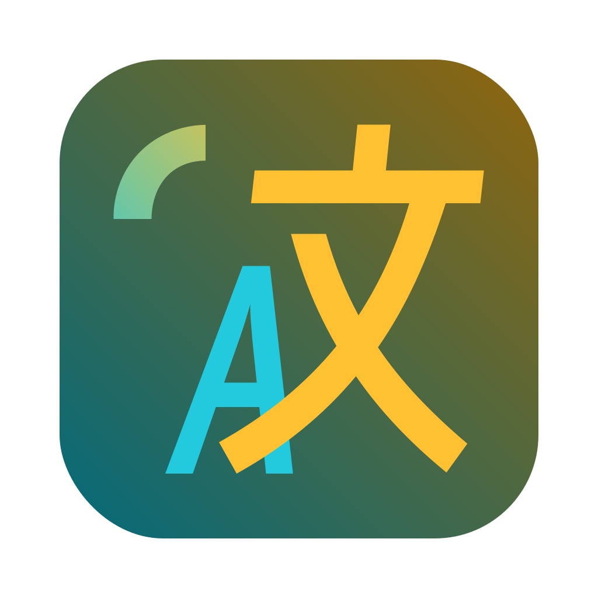
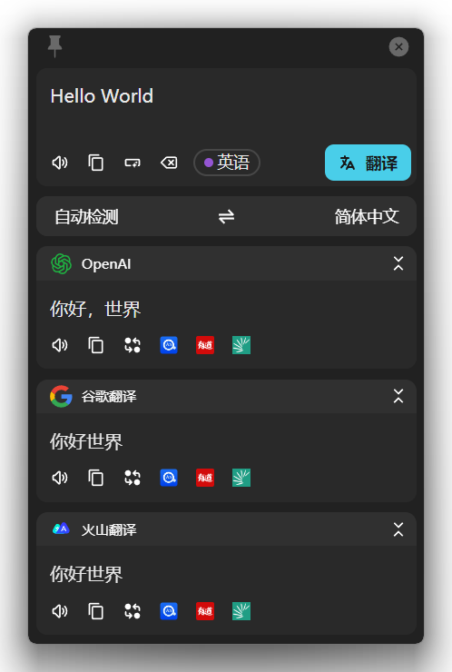
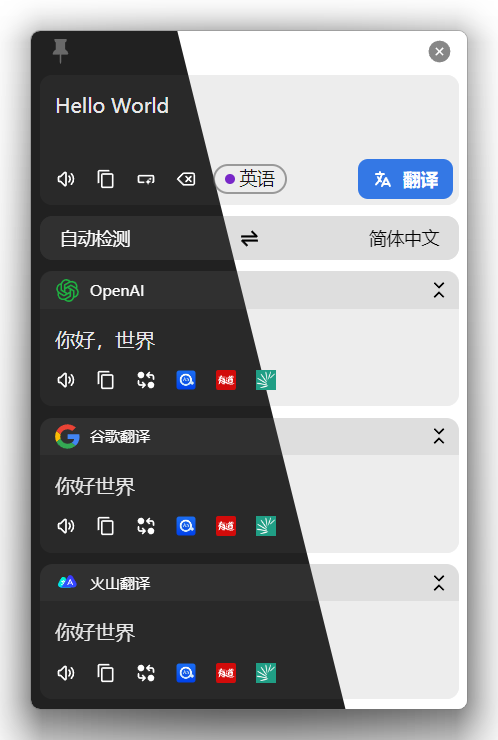
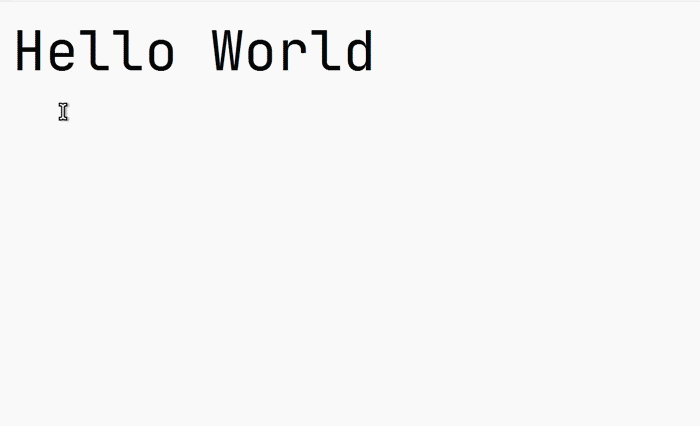
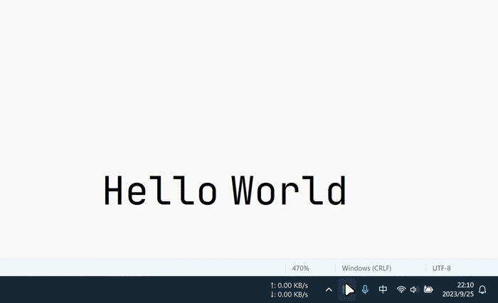
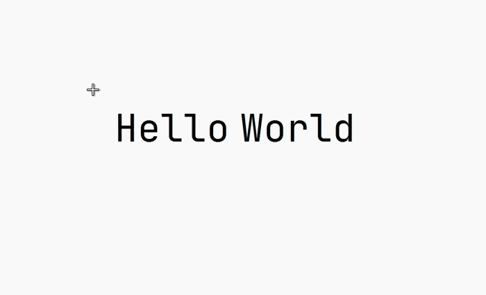
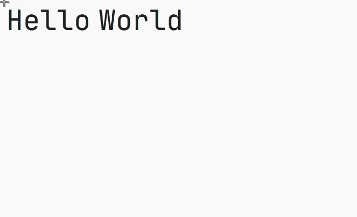

# Pot

> 🌈 A cross-platform translation software


<br/>
<hr/>
<div align="center">

<h3><a href='./README.md'>中文</a> | English | <a href='./README_KR.md'> 한글 </a></h3>

<table>
<tr>
    <td> 
    <td> 
    <td> 
</table>

# Table of Contents

</div>

-   [Usage](#usage)
-   [Features](#features)
-   [Supported Services](#supported-services)
-   [Plugin System](#plugin-system)
-   [Installation](#installation)
-   [External API](#external-api)
-   [Wayland Support](#wayland-support)

<div align="center">

# Usage

</div>

| Selection Translation                                    | Input Translation                                                              | External API                                                             |
| -------------------------------------------------------- | ------------------------------------------------------------------------------ | ------------------------------------------------------------------------ |
| Select the text to translate and press the hotkey        | Press the hotkey to open the translation window, input text and press Enter    | Can be called by other software for more convenient features, see [External API](#external-api) |
|                                |                                                      |                                                |

| Clipboard Monitoring                                                    | Screenshot OCR                                           | Screenshot Translation                               |
| ----------------------------------------------------------------------- | -------------------------------------------------------- | ---------------------------------------------------- |
| Click the icon on the translation panel to enable, copy text to translate | Press the hotkey and select the area to recognize        | Press the hotkey and select the area to translate    |
|                                               |                                |                            |

</div>

<div align="center">

# Features

</div>

-   [x] Multi-service parallel translation ([Supported Services](#supported-services))
-   [x] Multi-service OCR ([Supported Services](#supported-services))
-   [x] Multi-service TTS ([Supported Services](#supported-services))
-   [x] Export to vocabulary book ([Supported Services](#supported-services))
-   [x] External API ([Details](#external-api))
-   [x] Plugin system ([Plugin System](#plugin-system))
-   [x] All PC platforms (Windows, macOS, Linux)
-   [x] Wayland support (tested on KDE, Gnome, Hyprland)
-   [x] Multi-language UI

<div align="center">

# Supported Services

</div>

## Translation

-   [x] AI Translation (OpenAI Compatible, Anthropic, Gemini, Ollama)
-   [x] [Alibaba Translate](https://www.aliyun.com/product/ai/alimt)
-   [x] [Baidu Translate](https://fanyi.baidu.com/)
-   [x] [Caiyun](https://fanyi.caiyunapp.com/)
-   [x] [Tencent Transmart](https://fanyi.qq.com/)
-   [x] [Tencent Interactive Translate](https://transmart.qq.com/)
-   [x] [Volcengine Translate](https://translate.volcengine.com/)
-   [x] [NiuTrans](https://niutrans.com/)
-   [x] [Google](https://translate.google.com)
-   [x] [Bing](https://learn.microsoft.com/zh-cn/azure/cognitive-services/translator/)
-   [x] [Bing Dictionary](https://www.bing.com/dict)
-   [x] [DeepL](https://www.deepl.com/)
-   [x] [Youdao](https://ai.youdao.com/)
-   [x] [Cambridge Dictionary](https://dictionary.cambridge.org/)
-   [x] [Yandex](https://translate.yandex.com/)

See [Plugin System](#plugin-system) for more services.

## OCR

-   [x] System OCR (Offline)
    -   [x] [Windows.Media.OCR](https://learn.microsoft.com/en-us/uwp/api/windows.media.ocr.ocrengine?view=winrt-22621) on Windows
    -   [x] [Apple Vision Framework](https://developer.apple.com/documentation/vision/recognizing_text_in_images) on macOS
    -   [x] [Tesseract OCR](https://github.com/tesseract-ocr) on Linux
-   [x] [Tesseract.js](https://tesseract.projectnaptha.com/) (Offline)
-   [x] [Baidu](https://ai.baidu.com/tech/ocr/general)
-   [x] [Tencent](https://cloud.tencent.com/product/ocr-catalog)
-   [x] [Volcengine](https://www.volcengine.com/product/OCR)
-   [x] [iFlytek](https://www.xfyun.cn/services/common-ocr)
-   [x] [Tencent Image Translate](https://cloud.tencent.com/document/product/551/17232)
-   [x] [Baidu Image Translate](https://fanyi-api.baidu.com/product/22)
-   [x] [Simple LaTeX](https://simpletex.cn/)
-   [x] QR Code

## TTS

-   [x] [Lingva](https://github.com/thedaviddelta/lingva-translate)

## Vocabulary

-   [x] [Anki](https://apps.ankiweb.net/)
-   [x] [Eudic](https://dict.eudic.net/)

<div align="center">

# Plugin System

</div>

The built-in services are limited. You can extend functionality through the plugin system.

## Plugin Installation

Go to Preferences → Service Settings → Add External Plugin → Install External Plugin, and select the `.potext` file to install.

<div align="center">

# Installation

</div>

Download the installer for your platform from the [Release](https://github.com/CyrilPeng/pot-desktop/releases/latest) page:

| Platform | File |
|----------|------|
| Windows (64-bit) | `pot_{version}_x64-setup.exe` |
| Windows (32-bit) | `pot_{version}_x86-setup.exe` |
| Windows (ARM64) | `pot_{version}_arm64-setup.exe` |
| macOS (Apple Silicon) | `pot_{version}_aarch64.dmg` |
| macOS (Intel) | `pot_{version}_x64.dmg` |
| Linux (Debian/Ubuntu) | `pot_{version}_amd64.deb` |
| Linux (AppImage) | `pot_{version}_amd64.AppImage` |

### Troubleshooting

**Windows**: No UI after launch? Check if WebView2 is uninstalled/disabled. Download the WebView2-bundled version `pot_{version}_{arch}_fix_webview2_runtime-setup.exe` if needed.

**macOS**: "Cannot be opened because the developer cannot be verified"? Go to System Settings → Privacy & Security, click Open Anyway. If the file is damaged:

```bash
sudo xattr -d com.apple.quarantine /Applications/pot.app
```

**Linux (Nvidia)**: May crash with Webkit2Gtk 2.42.0. Add to `/etc/environment`:

```
WEBKIT_DISABLE_DMABUF_RENDERER=1
```

<div align="center">

# External API

</div>

Pot provides a complete HTTP API. Send requests to `127.0.0.1:port` where `port` defaults to `60828`.

## API Documentation

```bash
POST "/" => Translate text (body = text to translate),
GET "/config" => Open settings,
POST "/translate" => Translate text (same as "/"),
GET "/selection_translate" => Selection translate,
GET "/input_translate" => Input translate,
GET "/ocr_recognize" => Screenshot OCR,
GET "/ocr_translate" => Screenshot translate,
GET "/ocr_recognize?screenshot=false" => OCR (without built-in screenshot),
GET "/ocr_translate?screenshot=false" => Translate (without built-in screenshot),
```

## Example

```bash
curl "127.0.0.1:60828/selection_translate"
```

## Without Built-in Screenshot

1. Take a screenshot with another tool
2. Save to `$CACHE/com.pot-app.desktop/pot_screenshot_cut.png`
3. Send request to `127.0.0.1:port/ocr_recognize?screenshot=false`

> `$CACHE` is the system cache directory, e.g. `C:\Users\{username}\AppData\Local\com.pot-app.desktop\` on Windows

<div align="center">

# Wayland Support

</div>

## Hotkeys Not Working

Tauri's hotkey system does not support Wayland. Use system shortcuts with curl to trigger pot. See [External API](#external-api).

## Screenshot Not Working

On pure Wayland environments (e.g. Hyprland), use external screenshot tools. See [Without Built-in Screenshot](#without-built-in-screenshot).

## Translation Window Follows Mouse

Hyprland config example:

```conf
windowrulev2 = float, class:(pot), title:(Translator|OCR|PopClip|Screenshot Translate)
windowrulev2 = move cursor 0 0, class:(pot), title:(Translator|PopClip|Screenshot Translate)
```

## Build from Source

### Requirements

- Node.js >= 18.0.0
- pnpm >= 8.5.0
- Rust >= 1.80.0

### Steps

```bash
git clone https://github.com/CyrilPeng/pot-desktop.git
cd pot-desktop
pnpm install
pnpm tauri dev   # Development
pnpm tauri build # Build
```

Linux additional dependencies:

```bash
sudo apt-get install -y libgtk-3-dev libwebkit2gtk-4.0-dev libayatana-appindicator3-dev librsvg2-dev patchelf libxdo-dev libxcb1 libxrandr2 libdbus-1-3
```
